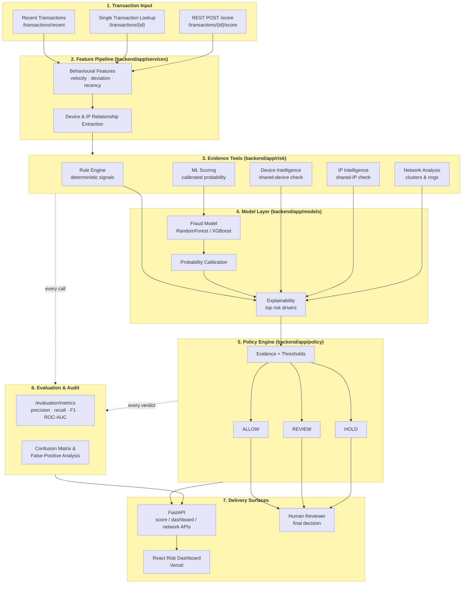

<div align="center">

# 🛡️ RazorSentry

**AI-Powered Fraud Risk Investigation System**

*Razorpay AI Buildathon · Track 02: AI Risk Manager*

[](https://razorsentry.vercel.app/)
[](https://razorsentry.onrender.com/docs)
[](#license)
[](#limitations)

[Live Demo](https://razorsentry.vercel.app/) · [API Docs](https://razorsentry.onrender.com/docs) · [Architecture](#architecture) · [Quick Start](#quick-start)

</div>

---

> ⚠️ **Cold start notice:** The backend runs on a free Render instance and may sleep after inactivity. The first request can take **20–30 seconds** to wake it up; once warm, requests typically complete in **under a second**.

> 🛡️ **Defense-only system:** RazorSentry recommends `ALLOW`, `REVIEW`, or `HOLD` based on transaction evidence. It **never** bans customers, seizes funds, or performs irreversible actions automatically. All data shown in the demo is synthetic.

---

## Table of Contents

- [The Idea](#the-idea)
- [Problem](#problem)
- [What RazorSentry Does](#what-razorsentry-does)
- [Key Capabilities](#key-capabilities)
- [Example Investigation](#example-investigation)
- [Architecture](#architecture)
- [Tech Stack](#tech-stack)
- [API Reference](#api-reference)
- [Evaluation](#evaluation)
- [Data Honesty](#data-honesty)
- [Design Decisions](#design-decisions)
- [Project Structure](#project-structure)
- [Quick Start](#quick-start)
- [Deployment](#deployment)
- [Defense-Only Guarantee](#defense-only-guarantee)
- [Limitations](#limitations)
- [License](#license)

---

## The Idea

Fraud doesn't always look suspicious at the transaction level.

A payment can appear completely normal on its own — yet become highly suspicious once combined with:

- Unusually high transaction velocity
- A device shared across many customers
- An IP address linked to multiple accounts
- Sudden geographic changes
- Abnormal spending behaviour
- Repeated failed attempts
- Coordinated activity across connected entities

Most basic fraud systems stop at:

> **"How risky is this transaction?"**

RazorSentry goes further:

> **"Why is this transaction risky, what is it connected to, and what should the risk team do next?"**

---

## Problem

Payment fraud creates a difficult trade-off for merchants:

- Too aggressive → legitimate customers get incorrectly flagged.
- Too lenient → fraudulent transactions slip through.

A single ML probability score doesn't give an analyst enough context to investigate confidently. Risk teams actually need:

1. Transaction-level signals
2. Behavioural context
3. Device and IP intelligence
4. Network-level relationships
5. Explainable reasons
6. A consistent decision policy

RazorSentry combines all six layers into one risk investigation workflow.

---

## What RazorSentry Does

RazorSentry combines **rules + calibrated ML + behavioural analysis + network intelligence + explainability + deterministic policy decisions**.

```text
Transaction
     │
     ▼
Feature Engineering
     │
     ├───────────────┐
     ▼               ▼
Rule Signals      ML Scoring
     │               │
     └───────┬───────┘
             ▼
      Behavioural Risk
             │
             ▼
      Network Intelligence
             │
             ▼
       Risk Evidence
             │
             ▼
       Explainability
             │
             ▼
       Policy Engine
             │
       ┌─────┼─────┐
       ▼     ▼     ▼
     ALLOW REVIEW HOLD
```

The key design decision: **the ML model does not make the final call.** It produces evidence. A deterministic policy engine converts that evidence into a recommended action — keeping the system predictable, testable, and auditable.

---

## Key Capabilities

### 1. Behavioural Risk Detection

RazorSentry builds behavioural features around each transaction instead of relying only on static fields:

| Signal | Description |
|---|---|
| Customer velocity | Transaction frequency per customer |
| Device velocity | Transaction frequency per device |
| IP velocity | Transaction frequency per IP |
| Failed attempts | Count of recent failed transactions |
| Amount deviation | Deviation from customer's average spend |
| Billing/shipping mismatch | Address inconsistency |
| Country changes | Sudden geographic shifts |
| Time since previous transaction | Recency pattern |
| Customer/device relationships | Cross-account device reuse |
| Customer/IP relationships | Cross-account IP reuse |

This surfaces abnormal behaviour that isn't visible from transaction amount alone.

### 2. Device Fingerprint Intelligence

A device can reveal hidden relationships between seemingly unrelated transactions.

```text
              Device
             /      \
            /        \
       Customer A   Customer B
           │            │
      Transactions  Transactions
```

Repeated device reuse across customers becomes an additional risk signal — surfacing shared devices, multi-account behaviour, and potentially coordinated activity.

### 3. IP Intelligence

The same relationship analysis is applied to IP addresses:

```text
IP Address
    │
    ├── Customer A
    ├── Customer B
    ├── Customer C
    └── Customer D
```

This lets RazorSentry flag suspicious IP/customer relationships instead of scoring every transaction in isolation.

### 4. Network-Level Fraud Detection

Fraud often operates as a network, not as isolated transactions:

```text
Customer
   │
   ├── Device
   │      │
   │      └── Other Customers
   │
   └── IP
          │
          └── Other Customers
```

This adds a second detection layer:

**Transaction risk → Entity risk → Network risk**

The dashboard surfaces potentially suspicious clusters and abuse rings based on shared infrastructure and behaviour.

### 5. Machine Learning Risk Scoring

A calibrated ML model estimates transaction-level fraud probability:

```text
Raw Dataset
     ↓
Data Processing
     ↓
Feature Engineering
     ↓
Behavioural Features
     ↓
Fraud Model
     ↓
Probability Calibration
     ↓
Fraud Risk Score
```

The ML layer is deliberately combined with deterministic rules and network evidence, so the decision system never depends on a single opaque model output.

### 6. Deterministic Policy Engine

Decisioning is handled separately from prediction:

```text
                ML Risk Score
                      │
                      ▼
Rule Signals ──► Evidence ◄── Network Signals
                      │
                      ▼
                Policy Engine
                      │
          ┌───────────┼───────────┐
          ▼           ▼           ▼
        ALLOW       REVIEW       HOLD
```

This separation keeps the decision process **predictable, testable, explainable, and auditable.** An LLM is never used to decide whether a transaction is allowed or held.

### 7. Explainable Risk Decisions

RazorSentry doesn't stop at a bare score:

```text
Risk Score: 0.91
```

It exposes the evidence behind the number:

```text
HIGH RISK
• Device shared across multiple customers
• High transaction velocity
• Amount significantly above customer baseline
• Billing and shipping country mismatch
• Suspicious IP/customer relationship
```

This lets an analyst move from *"the model says risky"* to *"here are the specific reasons it's risky."*

---

## Example Investigation

```text
Transaction
Amount: ₹18,450
Risk Score: HIGH
        │
        ├── Customer velocity: HIGH
        ├── Device shared: YES
        ├── IP shared: YES
        ├── Country changed: YES
        ├── Amount deviation: HIGH
        └── Failed attempts: 4
                │
                ▼
         Network Evidence
                │
                ▼
       Policy Recommendation
                │
                ▼
              HOLD
```

The recommendation is backed by multiple independent signals, not a single feature.

---

## Architecture

End-to-end investigation flow: transaction input, feature pipeline, evidence tools, model layer, policy engine, audit, and delivery surfaces.



> Rendered natively by GitHub — no image export needed. If viewing outside GitHub (e.g. an editor without Mermaid support), paste the block into the [Mermaid Live Editor](https://mermaid.live) to preview it.

### Who Decides What?

| Component | Responsibility |
|---|---|
| Feature Pipeline | Generates transaction and behavioural features |
| Rule Engine | Detects deterministic risk signals |
| ML Model | Produces fraud probability |
| Device Intelligence | Identifies suspicious device reuse |
| IP Intelligence | Identifies suspicious IP/customer relationships |
| Network Analysis | Surfaces connected entities and clusters |
| Explainability | Converts signals into human-readable reasons |
| Policy Engine | Maps evidence to ALLOW / REVIEW / HOLD |
| FastAPI | Serves investigation and scoring APIs |
| React Dashboard | Presents risk intelligence |
| **Human Reviewer** | **Makes the final operational decision** |

---

## Tech Stack

| Layer | Technology |
|---|---|
| Frontend | React, Vite |
| Frontend Hosting | Vercel |
| Backend | FastAPI (Python) |
| Backend Hosting | Render |
| ML | Calibrated fraud-probability model |
| Data | Synthetic transaction dataset |

---

## API Reference

Interactive Swagger docs: **https://razorsentry.onrender.com/docs**

**Health**

| Method | Endpoint |
|---|---|
| `GET` | `/health` |

**Dashboard**

| Method | Endpoint |
|---|---|
| `GET` | `/dashboard/summary` |
| `GET` | `/dashboard/fraud-trend` |

**Transactions**

| Method | Endpoint |
|---|---|
| `GET` | `/transactions/recent` |
| `GET` | `/transactions/{transaction_id}` |
| `POST` | `/transactions/{transaction_id}/score` |

**Network Intelligence**

| Method | Endpoint |
|---|---|
| `GET` | `/network/overview` |
| `GET` | `/network/suspicious-devices` |
| `GET` | `/network/suspicious-ips` |

**Model**

| Method | Endpoint |
|---|---|
| `GET` | `/model/status` |

**Evaluation**

| Method | Endpoint |
|---|---|
| `GET` | `/evaluation/metrics` |

---

## Evaluation

RazorSentry evaluates its fraud model on a held-out test set, covering:

- Precision
- Recall
- F1 Score
- ROC-AUC
- Confusion Matrix
- False-positive analysis

The pipeline measures both fraud-detection ability and the cost of incorrectly flagging legitimate transactions.

---

## Data Honesty

> The current dataset is **synthetic**. Evaluation results shown in the demo are **demo data** and should not be interpreted as production fraud-detection performance.

Synthetic datasets can contain highly separable patterns that make fraud classification look easier than it would be on real payment traffic. A production system would additionally require:

- Merchant-specific labelled data
- Continuous model monitoring
- Feature drift detection
- Model recalibration
- Threshold tuning
- False-positive cost analysis
- Human review workflows
- Confirmed-fraud feedback loops
- Delayed-label handling

---

## Design Decisions

| Decision | Approach | Reason |
|---|---|---|
| Fraud detection | Rules + ML | Combines explicit signals with learned patterns |
| Final decision | Deterministic policy engine | Keeps decisions predictable and auditable |
| Risk analysis | Transaction + network level | Fraud can involve coordinated entities |
| Device detection | Customer/device relationships | Detects suspicious device reuse |
| IP detection | Customer/IP relationships | Identifies potentially coordinated behaviour |
| Explainability | Explicit risk reasons | Analysts need evidence, not only scores |
| Model output | Calibrated probability | Better suited for risk thresholds |
| Actions | ALLOW / REVIEW / HOLD | Enables graduated intervention |
| Dataset | Synthetic | Avoids sensitive production payment data |
| Deployment | Vercel + Render | Public, reproducible demo architecture |

---

## Project Structure

```text
RazorSentry/
│
├── backend/
│   ├── app/
│   │   ├── api/
│   │   ├── core/
│   │   ├── models/
│   │   ├── network/
│   │   ├── policy/
│   │   ├── risk/
│   │   ├── services/
│   │   └── main.py
│   │
│   └── requirements.txt
│
├── frontend/
│   ├── src/
│   │   ├── components/
│   │   ├── pages/
│   │   ├── services/
│   │   └── ...
│   ├── package.json
│   └── vercel.json
│
├── data/
│   ├── raw/
│   └── processed/
│
├── ml/
│   ├── training/
│   ├── evaluation/
│   ├── models/
│   └── ...
│
├── docs/
│   ├── screenshots/
│   ├── ARCHITECTURE.md
│   └── MODEL_CARD.md
│
└── README.md
```

---

## Quick Start

### Backend

```bash
# Create a virtual environment
python -m venv venv

# Windows
.\venv\Scripts\activate

# Install dependencies
pip install -r backend/requirements.txt

# From the project root, set PYTHONPATH
$env:PYTHONPATH = (Get-Location).Path

# Start the API
uvicorn app.main:app --reload --app-dir backend
```

- Backend: `http://127.0.0.1:8000`
- Swagger: `http://127.0.0.1:8000/docs`

### Frontend

```bash
cd frontend
npm install
npm run dev
```

- Frontend: `http://localhost:5173`

---

## Deployment

### Frontend

Deployed on **Vercel**: https://razorsentry.vercel.app/

API requests are routed through a Vercel rewrite, so calls stay same-origin and avoid browser-side CORS issues:

```text
Browser
   │
   ▼
Vercel
   │
   │ /api/*
   ▼
Render
   │
   ▼
FastAPI
```

### Backend

Deployed on **Render**: https://razorsentry.onrender.com/

Start command:

```bash
PYTHONPATH=. uvicorn app.main:app --host 0.0.0.0 --port $PORT --app-dir backend
```

---

## Defense-Only Guarantee

RazorSentry is intentionally designed as a **risk-assistance** system.

**It may recommend:**
- ✅ ALLOW
- 🔍 REVIEW
- ⛔ HOLD

**It does NOT automatically:**
-  Ban customers
-  Close accounts
-  Seize funds
-  Permanently block users
-  Perform irreversible customer actions

The final operational decision always remains with a human reviewer.

---

## Limitations

RazorSentry is a **buildathon prototype**, not a production payment-risk platform. Current limitations include:

- Synthetic transaction data
- Limited historical data
- No live merchant feedback loop
- No production payment integration
- No distributed feature store
- No real-time stream-processing infrastructure
- No production-scale model monitoring

These are deliberate scope decisions for the prototype. The architecture is designed so these components can be added as the system moves toward production.

---

## Buildathon Context

Built for the **Razorpay AI Buildathon — Track 02: AI Risk Manager**.

> Fraud detection should not stop at a score. It should produce evidence that a risk team can investigate and act on.

RazorSentry combines:

**Behavioural Signals + Rule-Based Detection + Machine Learning + Device Intelligence + IP Intelligence + Network Analysis + Explainability + Deterministic Policy**

into a single transaction-risk investigation workflow.

---

## License

MIT License.
